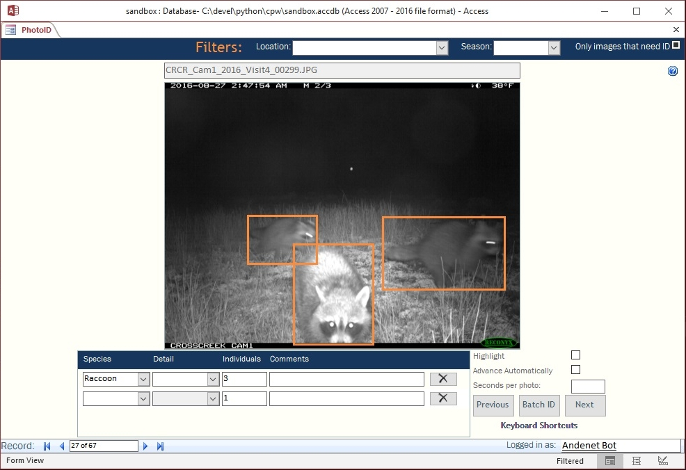

# First Observer

First Observer is a species detection and database import tool. The objective of First Observer is to mimic the "first observer" in a multi-observer image archive, identification, and analysis workflow.

First Observer is initially being develop to interface with [CPW Photo Warehouse](https://cpw.state.co.us/learn/Pages/ResearchMammalsSoftware.aspx), a custom Microsoft Access application designed to facilitate archiving, identifying, summarizing, and analyzing photo data collected from remote wildlife cameras.

###Basic Data Pipeline
1. Annotate image data for your project, using your favorite annotation tool, such as [Andenet-Desktop](https://github.com/persts/andenet-desktop)
2. Build an object detection model in Torch (YOLOv3) *\*Additional models and frameworks supported soon*
3. Launch First Observer
4. Select existing model and directory of new image data to analyze and import into database
5. Have a second observer (human) review & correct identifications in the database as normal

*Using CPW Photo Warehouse to evaluate First Observer's species identifications, counts, and bounding boxes.*

### Dependencies

First Observer is being developed on Windows 10 with the following libraries:

* PyQt5 (5.11.3)
* Pillow (5.4.1)
* Numpy (1.15.4)
* Opencv-python (3.4.5.20)
* Torch (1.0.0)

This is an emerging project currently under development. More information will be available soon.

###### Acknowledgements

Special thanks to Eric Newkirk from Colorado Parks and Wildlife for guidance on using CPW Photo Warehouse and providing a sample database and images.
